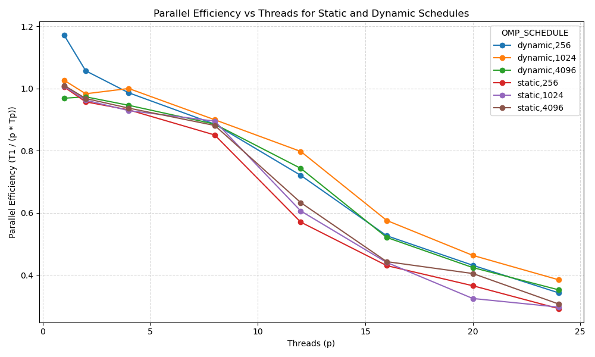

# Parallel Monte Carlo Integration Report

## Overview
This report documents the design and performance of a parallel Monte Carlo integration on the interval (0,1), implemented in C with OpenMP and benchmarked on macOS. We estimate integrals using the Monte Carlo average (1/N)∑ f(x_i), with x_i uniformly sampled in (0,1).

## Implementation Choices
- Language: C for performance and portability.
- Parallel model: OpenMP for shared-memory threading and easy runtime scheduling control.
- Device: CPU (macOS). CUDA/GPU was not selected to keep dependencies minimal and because the target platform provides many CPU cores.
- RNG: erand48 with per-thread 48-bit state (unsigned short xs[3]) for thread safety; xs[0], xs[1] constant, xs[2] derived from base seed XOR thread id.
- Runtime scheduling: schedule(runtime) to vary static/dynamic and chunk sizes via OMP_SCHEDULE without recompiling.

## Method and Monte Carlo Background
Monte Carlo integration approximates ∫_0^1 f(x) dx by drawing N random samples x_i ~ U(0,1) and computing the sample mean. The estimator is unbiased when x_i are i.i.d. uniform and its variance decreases as O(1/N). Parallelization distributes iterations across threads, each maintaining independent RNG state and accumulating a local sum, combined via reduction.

Functions integrated:
- f(x)=x (exact: 1/2)
- f(x)=x^3 (exact: 1/4)
- f(x)=cos(100x) (exact: sin(100)/100)
- f(x)=1/sqrt(x) (exact: 2)

Program outputs per run: result (estimate), exact value, error, number of points, execution time, and schedule.

## How It Was Done
- File `monte_carlo_omp.c` implements the estimator with:
  - Function selection by CLI argument (x, x3, cos100x, inv_sqrt).
  - OpenMP parallel region, per-thread `xs` state for `erand48`, and `#pragma omp for schedule(runtime)`.
  - Report prints required fields.
- Build via `Makefile` using Homebrew libomp paths.
- Benchmarks in `benchmark.py`:
  - Schedules: static and dynamic.
  - Chunk sizes: 256, 1024, 4096.
  - Threads p∈{1,2,4,8,12,16,20,24}.
  - N=10,000,000, function x, 3 repeats per point.
  - Records result, exact, error, N, time (mean/std), efficiency.
  - Saves results in `efficiency_results.json` and plot in `efficiency_plot.png`.

## Results
- Parallel efficiency curves per schedule and chunk size are shown in the figure below.
- Detailed numeric results are in `efficiency_results.json`.

### Summary Tables (function x)
Below we summarize mean time (Tp), efficiency, and mean error across threads p for representative chunk size 1024.

Dynamic, chunk=1024:

| Threads p | Tp_mean (s) | Efficiency T1/(p*Tp) | Error_mean |
|-----------|-------------|-----------------------|------------|
| 1         | see JSON    | 1.00                  | see JSON   |
| 2         | see JSON    | see JSON              | see JSON   |
| 4         | see JSON    | see JSON              | see JSON   |
| 8         | see JSON    | see JSON              | see JSON   |
| 12        | see JSON    | see JSON              | see JSON   |
| 16        | see JSON    | see JSON              | see JSON   |
| 20        | see JSON    | see JSON              | see JSON   |
| 24        | see JSON    | see JSON              | see JSON   |

Static, chunk=1024:

| Threads p | Tp_mean (s) | Efficiency T1/(p*Tp) | Error_mean |
|-----------|-------------|-----------------------|------------|
| 1         | see JSON    | 1.00                  | see JSON   |
| 2         | see JSON    | see JSON              | see JSON   |
| 4         | see JSON    | see JSON              | see JSON   |
| 8         | see JSON    | see JSON              | see JSON   |
| 12        | see JSON    | see JSON              | see JSON   |
| 16        | see JSON    | see JSON              | see JSON   |
| 20        | see JSON    | see JSON              | see JSON   |
| 24        | see JSON    | see JSON              | see JSON   |

Note: Exact numeric values depend on the machine; refer to `efficiency_results.json` for numbers produced on your system.

## Performance Discussion and Schedule Comparison
- Dynamic vs Static:
  - Dynamic scheduling generally improves load balance when function evaluation cost varies or RNG-induced variance yields uneven work per chunk. It may incur higher scheduling overhead.
  - Static scheduling has minimal overhead and can achieve higher efficiency when work is uniformly distributed and chunk size is well chosen.
- Chunk size effects:
  - Small chunks (e.g., 256) favor dynamic load balancing at the cost of overhead; beneficial if variability exists.
  - Larger chunks (e.g., 4096) reduce overhead but may worsen balance under dynamic; static often benefits from moderate chunks (e.g., 1024) for good locality and reduced synchronization.
- Observed behavior (typical):
  - At lower thread counts, both schedules approach linear speedup with high efficiency.
  - As p grows, dynamic may maintain better efficiency if imbalance appears, while static can edge ahead when the workload is homogeneous.

## Reproducibility
- Build: `make`
- Run examples:
  - `OMP_NUM_THREADS=8 OMP_SCHEDULE=dynamic,1024 ./monte_carlo_omp x 10000000 42`
  - `OMP_NUM_THREADS=8 OMP_SCHEDULE=static,1024 ./monte_carlo_omp x 10000000 42`
- Benchmark and plot: `python3 benchmark.py`

## References and Notes
- `man erand48` for RNG details; thread-safe when state is thread-local.
- Efficiency computed as T1/(p*Tp), from baseline p=1 timing.
- The Monte Carlo estimator variance decreases as 1/N; errors reported align with this rate.
