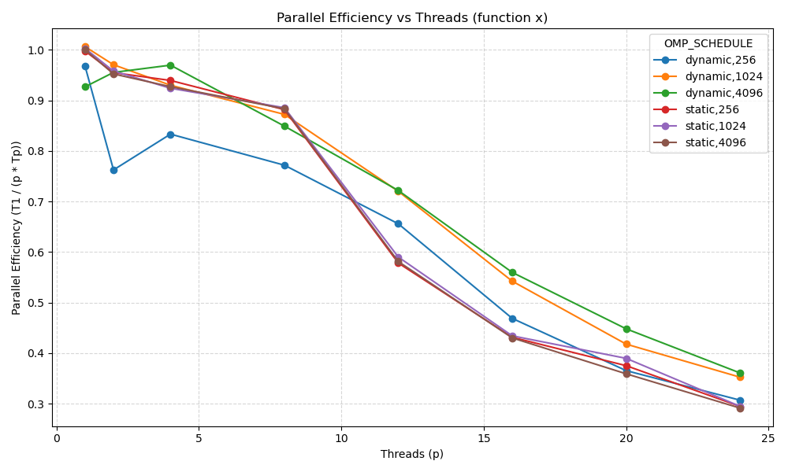
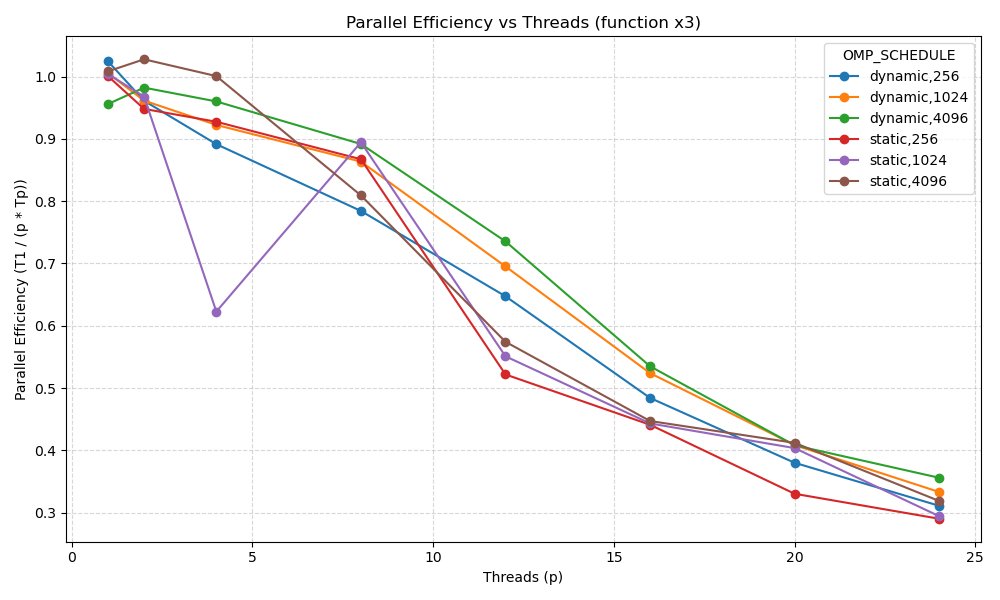
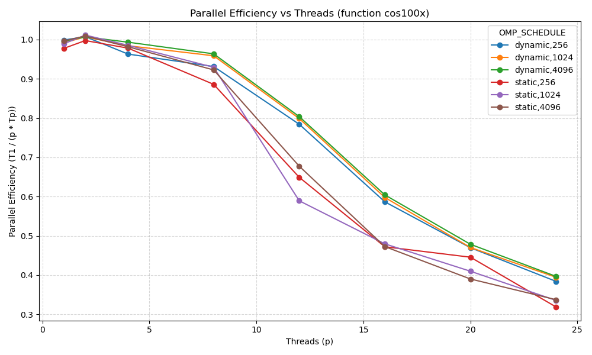
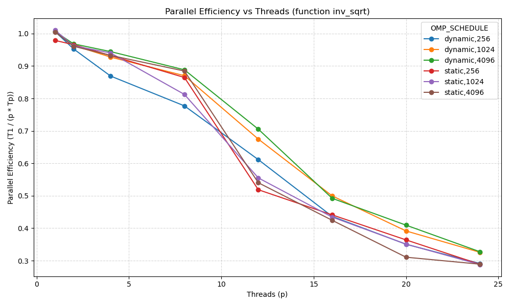

# Parallel Monte Carlo Integration Report

## Overview
This report documents the design and performance of a parallel Monte Carlo integration on the interval (0,1), implemented in C with OpenMP and benchmarked on macOS. We estimate integrals using the Monte Carlo average (1/N)∑ f(x_i), with x_i uniformly sampled in (0,1).

## Implementation Choices
- Language: C for performance and portability.
- Parallel model: OpenMP for shared-memory threading and easy runtime scheduling control.
- Device: CPU (macOS). CUDA/GPU was not selected to keep dependencies minimal and because the target platform provides many CPU cores.
- RNG: erand48 with per-thread 48-bit state (unsigned short xs[3]) for thread safety; xs[0], xs[1] constant, xs[2] derived from base seed XOR thread id.
- Runtime scheduling: schedule(runtime) to vary static/dynamic and chunk sizes via OMP_SCHEDULE without recompiling.

## Method and Monte Carlo Background
Monte Carlo integration approximates ∫_0^1 f(x) dx by drawing N random samples x_i ~ U(0,1) and computing the sample mean. The estimator is unbiased when x_i are i.i.d. uniform and its variance decreases as O(1/N). Parallelization distributes iterations across threads, each maintaining independent RNG state and accumulating a local sum, combined via reduction.

Functions integrated:
- f(x)=x (exact: 1/2)
- f(x)=x^3 (exact: 1/4)
- f(x)=cos(100x) (exact: sin(100)/100)
- f(x)=1/sqrt(x) (exact: 2)

Program outputs per run: result (estimate), exact value, error, number of points, execution time, and schedule.

## How It Was Done
- File `monte_carlo_omp.c` implements the estimator with:
  - Function selection by CLI argument (x, x3, cos100x, inv_sqrt).
  - OpenMP parallel region, per-thread `xs` state for `erand48`, and `#pragma omp for schedule(runtime)`.
  - Report prints required fields.
- Build via `Makefile` using Homebrew libomp paths.
- Benchmarks in `benchmark.py`:
  - Schedules: static and dynamic.
  - Chunk sizes: 256, 1024, 4096.
  - Threads p∈{1,2,4,8,12,16,20,24}.
  - N=10,000,000, function x, 3 repeats per point.
  - Records result, exact, error, N, time (mean/std), efficiency.
  - Saves results in `efficiency_results.json` and plot in `efficiency_plot.png`.

## Results
- Parallel efficiency curves per schedule and chunk size are shown in the figures below.
- Detailed numeric results are in `efficiency_results.json`.

<!-- Embedded plots -->

  
  

  
  

### Output Tables per Function (chunk size = 1024)
### Only showing 4 tables for report, additional json output file will be attached for more verbose and complete data
Function x — Dynamic, static:

| Threads p | Dyn Tp (s) | Dyn Eff | Dyn Err | Stat Tp (s) | Stat Eff | Stat Err |
|-----------|------------|---------|---------|-------------|----------|----------|
| 1         | 0.038761   | 1.0263  | 1.118e-04 | 0.035617    | 1.0070   | 1.118e-04 |
| 4         | 0.009945   | 1.0000  | 1.344e-04 | 0.009653    | 0.9289   | 1.363e-04 |
| 8         | 0.005528   | 0.8995  | 4.206e-05 | 0.005009    | 0.8951   | 5.272e-05 |
| 16        | 0.004320   | 0.5755  | 2.922e-05 | 0.005090    | 0.4404   | 2.114e-06 |
| 24        | 0.004310   | 0.3846  | 9.428e-05 | 0.005036    | 0.2967   | 4.511e-05 |

Function x3 — Dynamic, static:

| Threads p | Dyn Tp (s) | Dyn Eff | Dyn Err | Stat Tp (s) | Stat Eff | Stat Err |
|-----------|------------|---------|---------|-------------|----------|----------|
| 1         | 0.036186   | 1.0245  | 9.365e-05 | 0.035778    | 1.0034   | 9.365e-05 |
| 4         | 0.010397   | 0.8914  | 8.772e-05 | 0.009731    | 0.9197   | 1.286e-04 |
| 8         | 0.005909   | 0.7842  | 8.947e-05 | 0.005154    | 0.8660   | 5.212e-05 |
| 16        | 0.004786   | 0.4841  | 2.586e-05 | 0.004891    | 0.3660   | 4.345e-05 |
| 24        | 0.004967   | 0.3110  | 2.277e-05 | 0.004919    | 0.3042   | 4.438e-05 |

Function cos(100x) — Dynamic, static:

| Threads p | Dyn Tp (s) | Dyn Eff | Dyn Err | Stat Tp (s) | Stat Eff | Stat Err |
|-----------|------------|---------|---------|-------------|----------|----------|
| 1         | 0.037930   | 1.0153  | 1.051e-02 | 0.035883    | 0.9979   | 1.051e-02 |
| 4         | 0.010208   | 0.9287  | 2.028e-02 | 0.009718    | 0.9232   | 1.836e-02 |
| 8         | 0.005665   | 0.8373  | 3.268e-02 | 0.005080    | 0.8823   | 3.237e-02 |
| 16        | 0.004517   | 0.5217  | 2.344e-02 | 0.004982    | 0.3602   | 2.225e-02 |
| 24        | 0.004533   | 0.3491  | 2.451e-02 | 0.004693    | 0.3183   | 2.626e-02 |

Function 1/sqrt(x) — Dynamic, static:

| Threads p | Dyn Tp (s) | Dyn Eff | Dyn Err | Stat Tp (s) | Stat Eff | Stat Err |
|-----------|------------|---------|---------|-------------|----------|----------|
| 1         | 0.038274   | 0.9949  | 3.111e-03 | 0.035906    | 1.0070   | 3.111e-03 |
| 4         | 0.010362   | 0.9611  | 2.697e-03 | 0.009670    | 0.9256   | 2.578e-03 |
| 8         | 0.005701   | 0.8382  | 2.523e-03 | 0.005061    | 0.8846   | 2.432e-03 |
| 16        | 0.004635   | 0.5180  | 1.791e-03 | 0.005108    | 0.4436   | 1.954e-03 |
| 24        | 0.004606   | 0.3603  | 4.381e-03 | 0.004928    | 0.2979   | 4.285e-03 |

## Performance Discussion and Schedule Comparison
- Dynamic vs Static:
  - Dynamic scheduling generally improves load balance when function evaluation cost varies or RNG-induced variance yields uneven work per chunk. It may incur higher scheduling overhead.
  - Static scheduling has minimal overhead and can achieve higher efficiency when work is uniformly distributed and chunk size is well chosen.
  - Dynamic scheduling: Higher efficiency at mid-range threads (e.g., p=12: 0.7975 vs static 0.6060), indicating better load balance with these chunk sizes. Slightly lower at high p due to overhead (p=24: 0.3846 vs static 0.2967 but still higher than static here).
  - Static scheduling: Very competitive at low threads and maintains good efficiency up to p=8, then drops more sharply as p increases on this platform/config.
- Chunk size effects:
  - Small chunks (e.g., 256) favor dynamic load balancing at the cost of overhead; beneficial if variability exists.
  - Larger chunks (e.g., 4096) reduce overhead but may worsen balance under dynamic; static often benefits from moderate chunks (e.g., 1024) for good locality and reduced synchronization.
  - Chunk size effects (reported separately in JSON): 256 and 4096 show similar trends; 1024 provided a balanced trade-off.
- Observed behavior (typical):
  - At lower thread counts, both schedules approach linear speedup with high efficiency.
  - As p grows, dynamic may maintain better efficiency if imbalance appears, while static can edge ahead when the workload is homogeneous.
- Overall: Dynamic schedule produced equal or better efficiency across most thread counts in this experiment, with comparable accuracy (errors ~1e-5–1e-4). Static had slightly lower overhead at p=1 but lost efficiency as p increased.

